# Description

PTFE deploy in production mode on AWS using Terraform with mounted disk type of installation

will use:
- mounted disk for data to `/mountdisk`
- mounted disk for snapshots to `/var/lib/replicated/snapshots`

# Pre-requirements

- [Terraform](https://www.terraform.io)
- [PTFE](https://www.terraform.io/docs/enterprise/index.html)
- License (provided by HashiCorp)
- Get Letsencrypt certificate (or any other valid)
- DNS [record](https://www.cloudflare.com/)
- [AWS](https://aws.amazon.com) account
  - we will use m5.large as [recommended](https://www.terraform.io/docs/enterprise/before-installing/reference-architecture/aws.html) type

## clone the repository

```
git clone git@github.com:andrewpopa/ptfe-tf-prod-mode.git
cd ptfe-tf-prod-mode
```

## configure AWS credentials

as ENV variables in my case

```bash
cat .bash_profile
export AWS_ACCESS_KEY_ID=
export AWS_SECRET_ACCESS_KEY=
export AWS_DEFAULT_REGION=
```

## configure networking vars

check `modules/networking/variables.tf` you can modify the following parameters accordingly to your need 
- vpc network
- subnet
- availability zone

## configure ec2 vars

make sure that you have pre-filled key name
```bash
variable "key_name" {}
```

and public ssh key for your ec2
```bash
variable "public_key" {}
```

check `modules/ec2/variables.tf` and modify ec2 `map` accordingly to your need 

```bash
variable "ec2_instance" {
  type = "map"
  default = {
    "type"          = "m5.large"
    "root_hdd_size" = 50
    "root_hdd_type" = "gp2"
    "ebs_hdd_size"  = 100
    "ebs_hdd_type"  = "gp2"
    "ebs_hdd_name1"  = "/dev/nvme1n1"
    "ebs_hdd_name2"  = "/dev/nvme2n1"
  }
}
```

# How to use this

After you changed env vars for your need, apply the changes. The following infra will be created:
- vpc
- subnet
- internet gateway
- routing table
- security group
- ec2 instance

```
terraform init 
terraform apply
```

as an output you'll get `dns name` and `ip address` of your server

## configure dns

I'm using cloudflare as DNS provider. In your case can be something else. You need to point your domain which you'll use to ec2 instance which was created

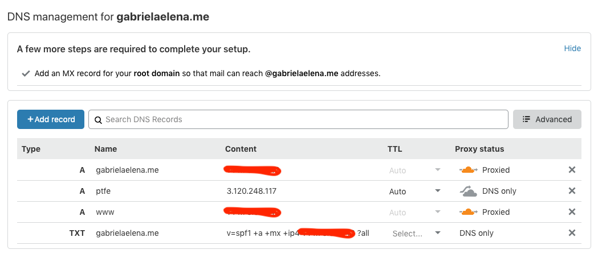

## cli install

one ec2 is provisioned, connect to the instance and run cli installer

```bash
curl https://install.terraform.io/ptfe/stable | sudo bash
```

confirm ip address where will run PTFE and ignore(in out case) configuring proxy

```bash
Determining service address
The installer will use service address 'xxx.xxx.xxx.xxx' (discovered from EC2 metadata service)
The installer has automatically detected the service IP address of this machine as xxx.xxx.xxx.xxx
Do you want to:
[0] default: use xxx.xxx.xxx.xxx
[1] enter new address
Enter desired number (0-1): Does this machine require a proxy to access the Internet? (y/N)
```

## web browser configuration

once cli installation is done, switch to web browser to continue installation

go to [http://ptfe.gabrielaelena.me:8800](http://ptfe.gabrielaelena.me:8800)

Accept the risk with

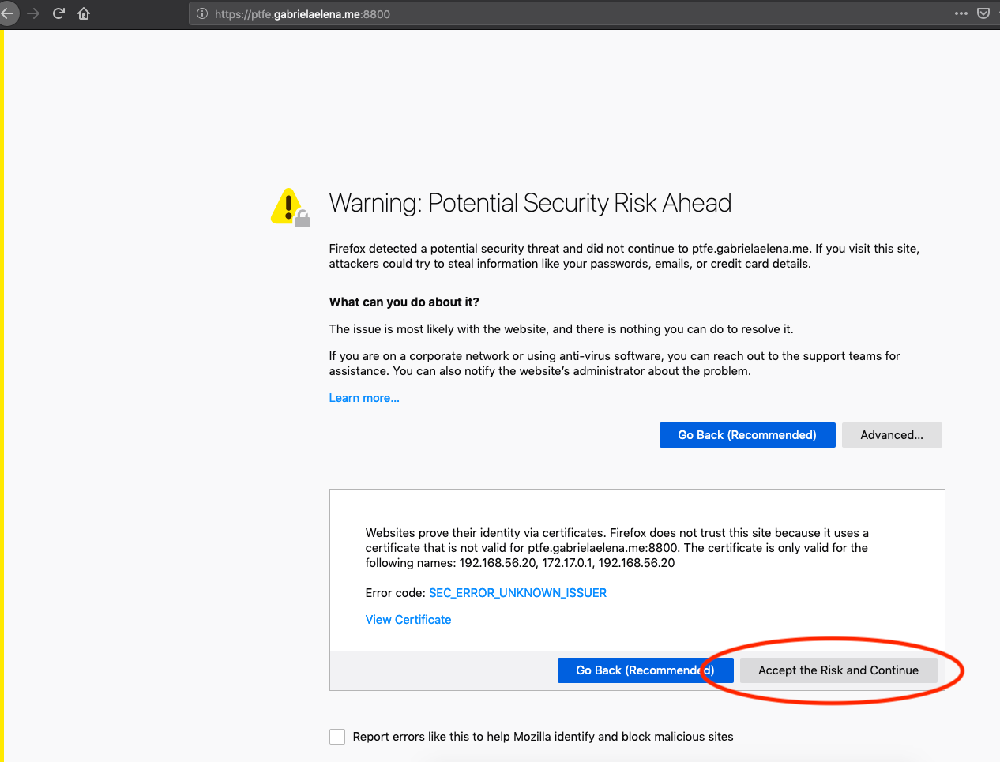

## https for admin console

upload your valid certificates. I got it from Letsencrypt using certbot

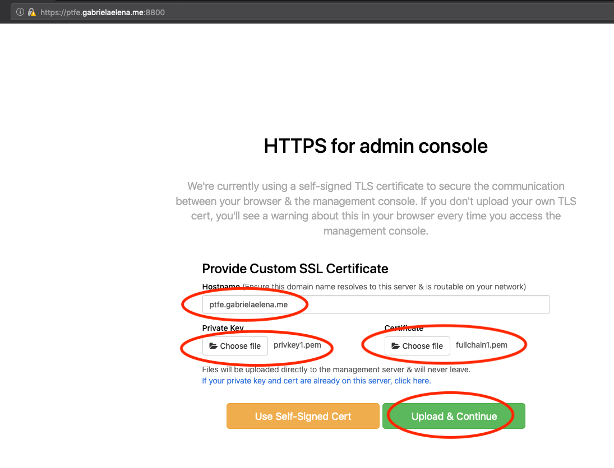

## upload your license

upload the license which you have from HashiCorp

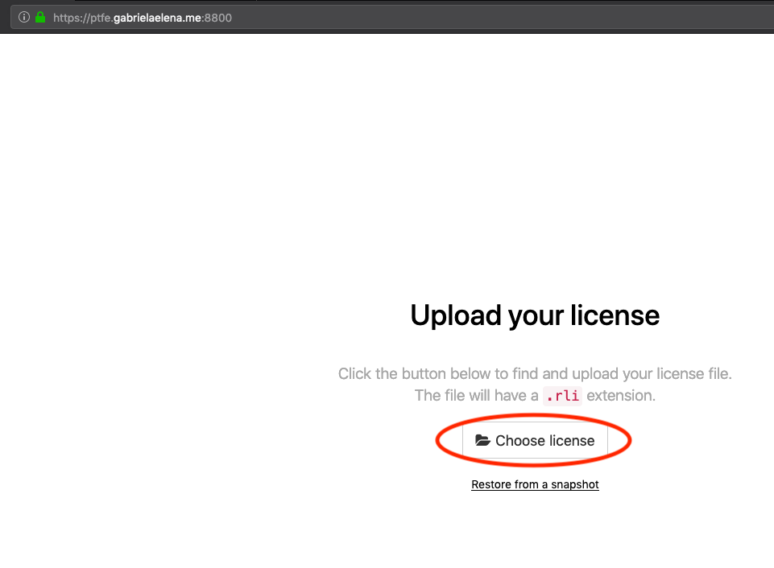

## choose your installation type

let's use online type of installation

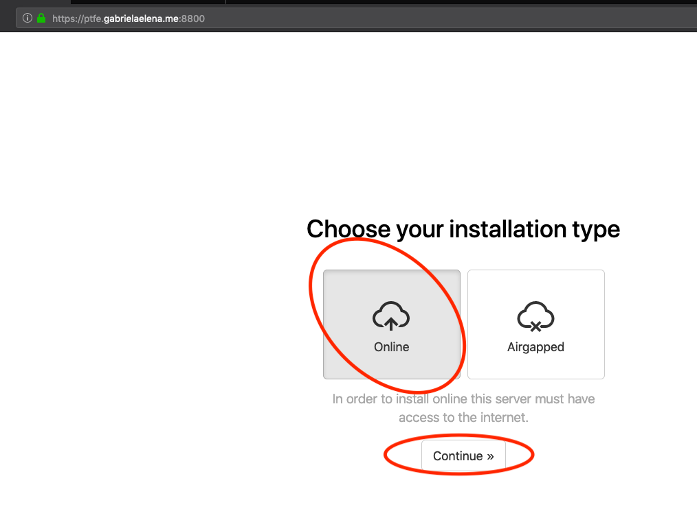

## secure the admin console

use custom password for admin console


## preflight checks

make sure you pass all preglight checks 

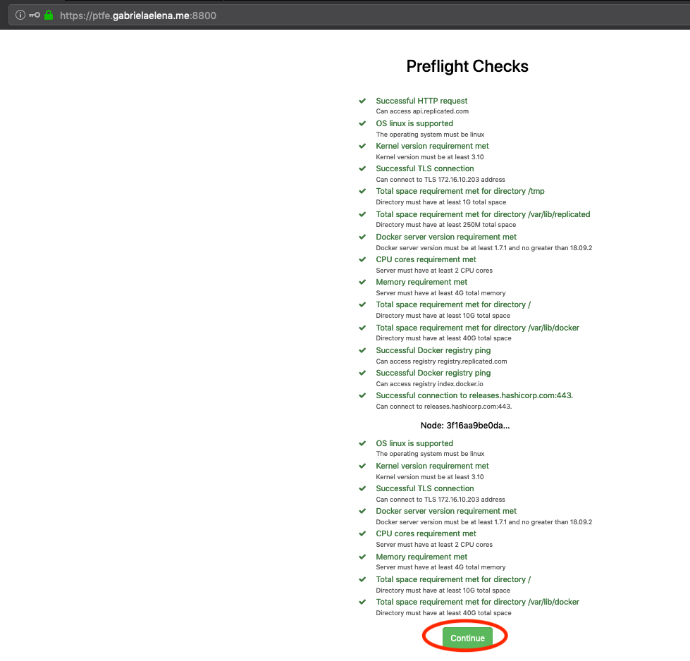

## settings

configure settings for your installation
- make sure FQDN set properly
- use custom password for encryption
- choose installation type `production`
- we will use mounted disk
- specify the mountpoint for your mounted disk

don't forget to press **Save** in the bottom of the page

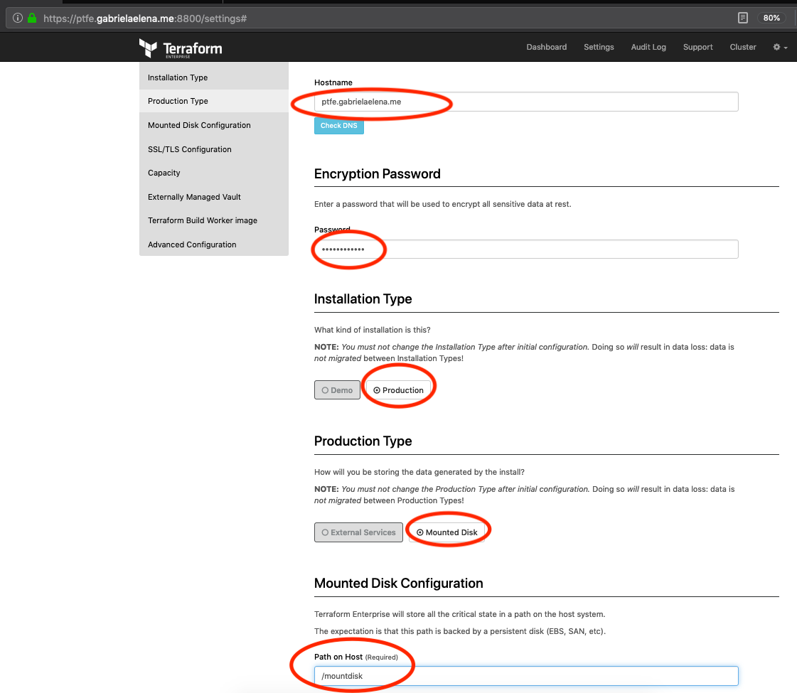

## components

wait until all components will be downloaded and application will start

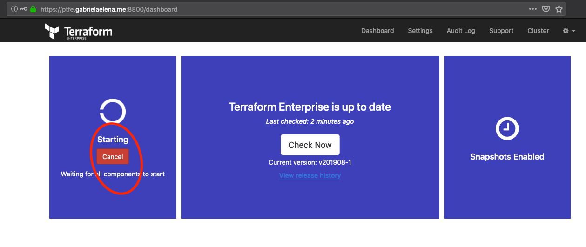

## install complete

once all components are downloaded and application is `started` you can open application

also click on `Start snapshot` to create your first snapshot manually

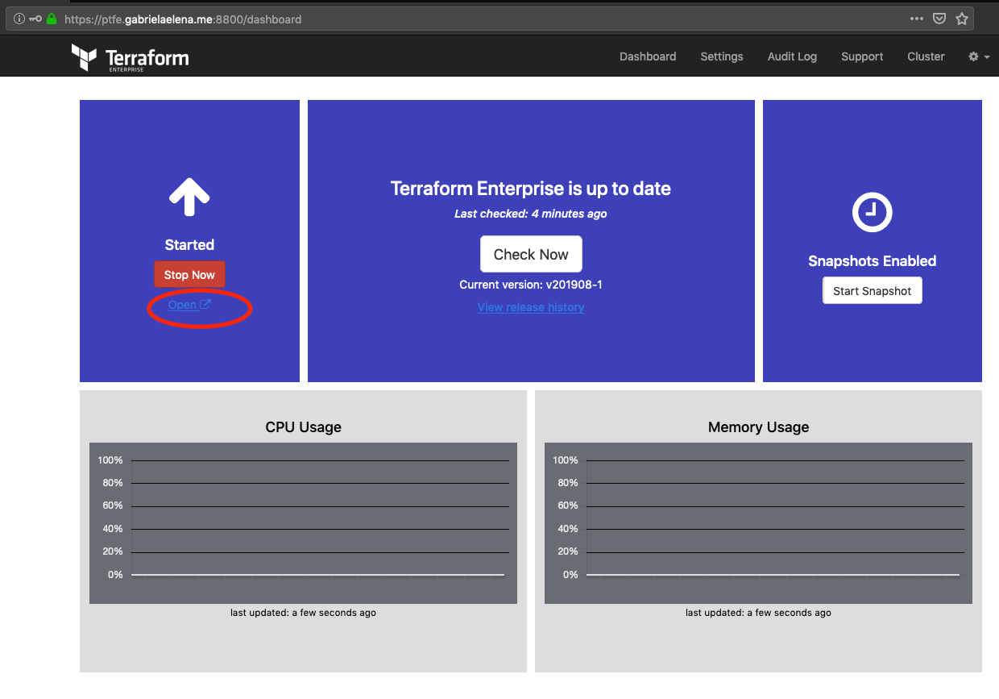

when you open your application create new user account

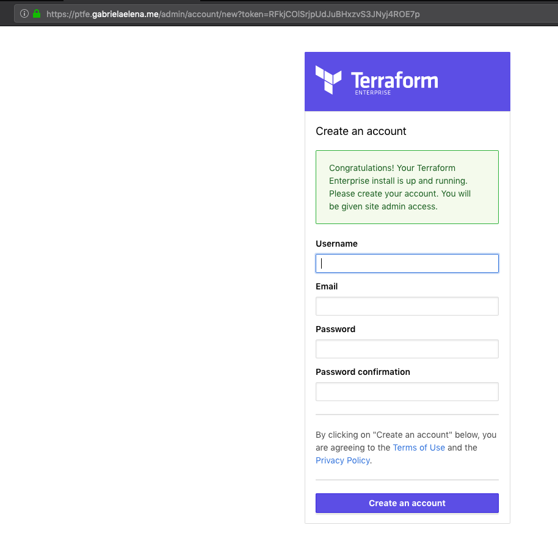

## automatic snapshots

after snapshot will be created

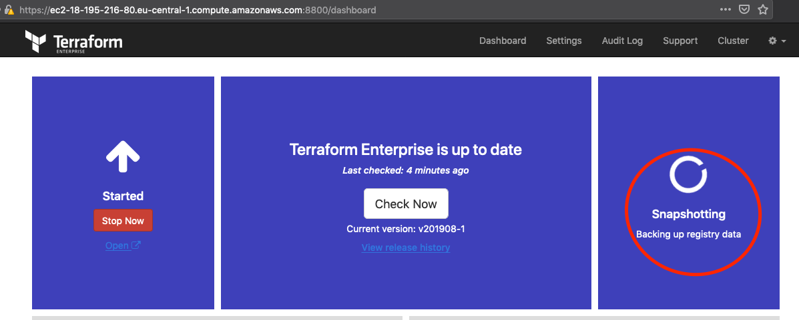

go and configure automatic snapshots

by going to - `console settings`

click - `Enable Automatic Scheduled Snapshots`

select - `Daily`

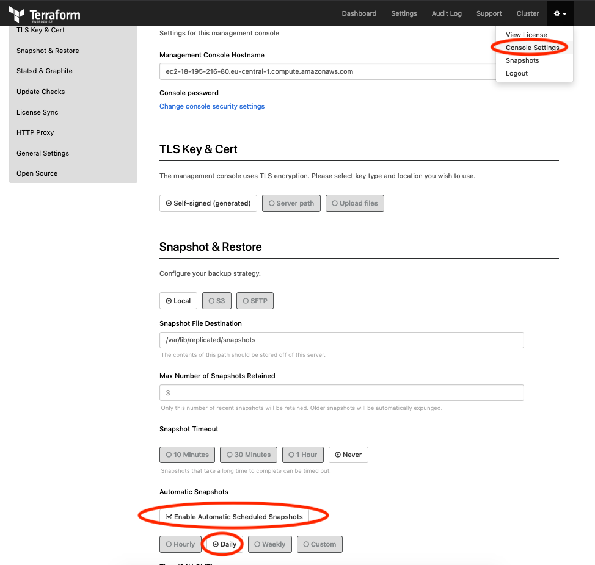

Enjoy!
