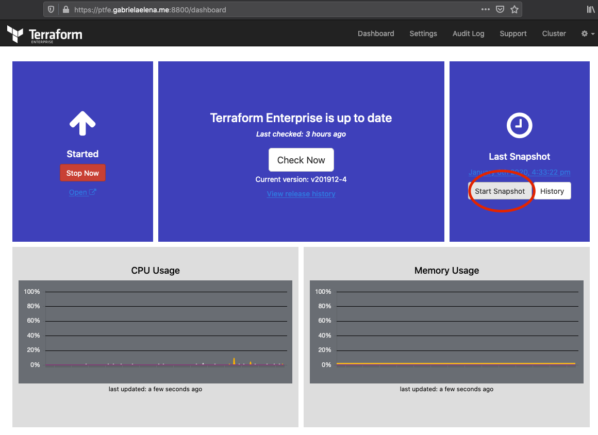

# Description

Monolithic terraform code which will deploy PTFE in production mode on AWS with mounted disk type of installation

will use mount points:
- mounted disk for data to `/mountdisk`
- mounted disk for snapshots to `/var/lib/replicated/snapshots`

# Pre-requirements

- [Terraform](https://www.terraform.io)
- [PTFE](https://www.terraform.io/docs/enterprise/index.html)
- License (provided by HashiCorp)
- Get Letsencrypt certificate (or any other valid)
- DNS [record](https://www.cloudflare.com/)
- [AWS](https://aws.amazon.com) account
  - we will use m5.large as [recommended](https://www.terraform.io/docs/enterprise/before-installing/reference-architecture/aws.html) type

## clone the repository

```
git clone git@github.com:andrewpopa/ptfe-tf-prod-mode.git
cd ptfe-tf-prod-mode
```

## configure AWS credentials

as ENV variables in my case

```bash
cat .bash_profile
export AWS_ACCESS_KEY_ID=
export AWS_SECRET_ACCESS_KEY=
export AWS_DEFAULT_REGION=
```

## networking vars

check `modules/networking/variables.tf` you can modify the following parameters accordingly to your need 

| **Name**  | **Default** | **Required** | **Description** |
| ------------- | ------------- | ------------- | ------------- | ------------- |
vpc_block | 172.16.0.0/16 | yes | VPC cidr
sub_block_a | 172.16.11.0/24 | yes | sunbet A 
sub_block_b | 172.16.11.0/24 | yes | subnet B
a_zone_a | eu-central-1a | yes | AZ 
a_zone_b | eu-central-1b | yes | AZ


## ec2 vars

check `modules/ec2/variables.tf` and modify variables accordingly to your needs 

| **Name**  | **Default** | **Required** | **Description** |
| ------------- | ------------- | ------------- | ------------- | ------------- |
public_key |  | yes | Public key
ami_type | ami-0085d4f8878cddc81 | yes | sunbet A 
ec2_instance['type'] | m5.large | yes | EC instance type
ec2_instance['root_hdd_size']  | 50 | yes | root hdd size 
ec2_instance['root_hdd_type']  | gp2 | yes | root hdd type
ec2_instance['ebs_hdd_size']  | eu-central-1b | yes | hdd size
ec2_instance['ebs_hdd_type']  | eu-central-1b | yes | hdd type
ec2_instance['ebs_hdd_name1']  | eu-central-1b | yes | hdd1 name
ec2_instance['ebs_hdd_name2']  | eu-central-1b | yes | hdd2 name


## dns vars

check `main.tf` under dns modules

| **Name**  | **Default** | **Required** | **Description** |
| ------------- | ------------- | ------------- | ------------- | ------------- |
api_email | email@domain.com | yes | email which access cloudflare API
api_token |  | yes | CloudFlare API token
zone_id |  | yes | CloudFlare zone token
cf_domain  | gabrielaelena.me | yes | Domain managed by CF 
cf_sub_domain  | ptfe | yes | Sub-domain managed by CF
pointer | load-balancer-output | yes | Load balancer
record_type  | CNAME | yes | cname record for load balancer

# silent installation module

check `modules/silent/variables.tf` and modify variables accordingly to your needs 

| **Name**  | **Default** | **Required** | **Description** |
| ------------- | ------------- | ------------- | ------------- | ------------- |
dashboard_password | Password123# | yes | Initial password for PTFE dashboard

# How to use this

After you changed env vars for your need, apply the changes. The following infra will be created:
- vpc
- subnet
- internet gateway
- routing table
- security group
- ec2 instance

```
terraform init 
terraform apply
```

as an output you'll get `dns name` and `ip address` of your server


## Outputs
| **Name**  | **Value** |
| ------------- | ------------- |
aws_ptfe_dns | dns-name-of-created-ec2-instance
aws_ptfe_private_ip | private ip for ec2
aws_ptfe_public_ip | public ip for ec2
lb_dns | load balancer name
ptfe_fqdn | FQDN where application can be reached

# Failure imitation

After the instance is created and you can login in it. The logic of the application is done in the way you can imitate application failure.

## Create snapshot

You must create manual snapshot from admin panel.



After snapshot is done perform 

`terraform state list`

to see the state list of all resources which were created


```
module.dns.cloudflare_record.record_name
module.ec2.aws_ebs_volume.ptfe_cloud_volume_db
module.ec2.aws_ebs_volume.ptfe_cloud_volume_replica
module.ec2.aws_instance.ptfe_cloud_prod_mode
module.ec2.aws_key_pair.ec2
module.ec2.aws_volume_attachment.ptfe_volume_db
module.ec2.aws_volume_attachment.ptfe_volume_replica
module.networking.aws_iam_server_certificate.ptfe_cert
module.networking.aws_internet_gateway.main_gw
module.networking.aws_lb.alb
module.networking.aws_lb_listener.alb_listener_admin
module.networking.aws_lb_listener.alb_listener_frontend
module.networking.aws_lb_target_group.alb_target_admin
module.networking.aws_lb_target_group.alb_target_frontend
module.networking.aws_lb_target_group_attachment.alb_attach_admin
module.networking.aws_lb_target_group_attachment.alb_attach_frontend
module.networking.aws_main_route_table_association.main
module.networking.aws_route_table.main_routing_table
module.networking.aws_security_group.sg_cloud_prod_mode
module.networking.aws_subnet.main_sub_a
module.networking.aws_subnet.main_sub_b
module.networking.aws_vpc.main_vpc
module.silent.data.template_file.application_settings
module.silent.data.template_file.replicated
module.silent.null_resource.silent
```

## Mark 2 resources as taint 
so, at next `apply` this resources will be recreated

```
➜  ptfe-aws-md git:(master) ✗ terraform taint module.ec2.aws_instance.ptfe_cloud_prod_mode
Resource instance module.ec2.aws_instance.ptfe_cloud_prod_mode has been marked as tainted.
➜  ptfe-aws-md git:(master) ✗ terraform taint module.silent.null_resource.silent
Resource instance module.silent.null_resource.silent has been marked as tainted.
```

run `terraform apply`

After `apply` will be done, once you logged in back, the instance was restored automatically from snapshot which you created.

